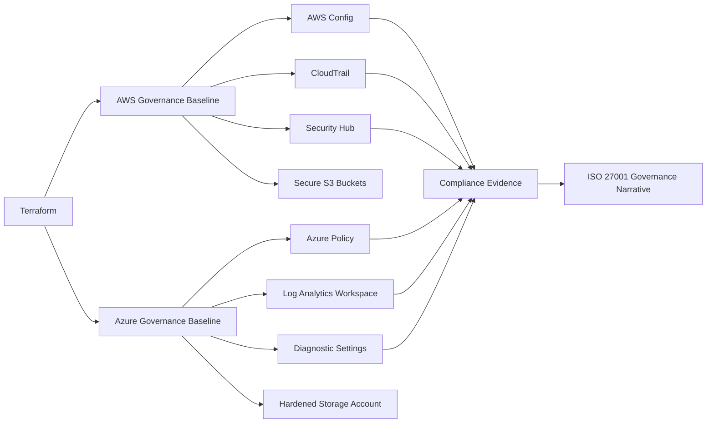

+++
date = '2026-04-20T20:43:04-04:00'
title = 'GaC Project Architecture'
draft = false

[build]
  list = "never"
  render = "always"
+++

# Architecture Overview

## Goal

This project demonstrates how to translate governance objectives into repeatable technical controls on Azure.

## Design principles

1. **Codified controls** rather than manual point-and-click setup
2. **Small but explainable baseline** suitable for a portfolio demonstration
3. **Use cloud-native governance services** to show platform fluency
4. **Preserve auditability** through logging, policy, and configuration monitoring
5. **Map controls to governance language** such as ISO/IEC 27001:2022

## High-level architecture

## Azure control path

Terraform deploys a governance baseline consisting of:
- policy definitions
- policy assignments
- log analytics workspace
- - hardened storage account configuration

The result is a simple but credible Azure governance story:
- define policy expectations
- assign them to a scope
- evaluate compliance continuously
- keep operational telemetry

## Why this matters from a governance perspective

Cloud governance often fails when controls are documented but not operationalized.
This architecture shows a practical model:

- policy intent becomes machine-readable definition
- infrastructure deployment becomes repeatable code
- control checking becomes platform-native evidence
- governance language becomes traceable to technical outcomes
